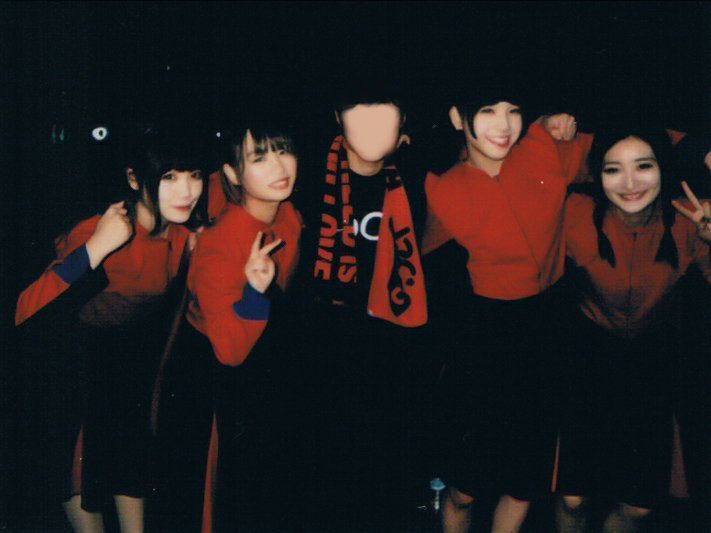
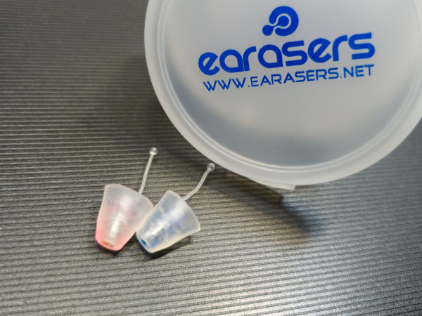

+++
date = "2020-01-26T19:44:45+09:00"
Title = "NHKツアーファイナル"
+++
BiSHのNEW HATEFUL KiND TOURファイナルに行ってきた。

#### BiSH券確保作戦

久しぶりのライブだったのでチェキがとりたいなと思い、前泊なしで一番早く着けるように作戦を立てた。

3時起きで準備をし、家を出るのは4時頃。そこから高速バスに乗って東京駅へと向かい、電車で最寄りの渋谷駅へ移動するという作戦だ。

ただ、最近BiSHへの注目の集まりかたは尋常じゃない。券が枯れてしまった時には潔く諦めよう。

そして当日の朝、NHKホールには6:50頃到着。既に前日と比べてもはるかに多くの清掃員が並んでいる。

ポツポツと雨も降っていたため、天気予報をみて持ってきていた折りたたみ傘をさしながら3時間弱待機。

もうそろそろ買えるかなと思った時に「もうそろそろBiSH券なくなりまーす」とのアナウンス。

あと10人ほどのところまで来たところで券が枯れてしまった。

もう少し渋谷駅からNHKホールまで急いで来ていれば券を確保できていたのではと思いつつ、しかしこうなってしまったら諦めると決めていたので、BiSHの人気がぐんぐん上がっていることに感動しつつ開演まで時間を潰すことにした。

チェキがとれなかったのは少しさみしいが、その分のお金が貯金できたと自分を納得させる。3月のWACKツアーではリベンジしたいなぁ。

#### 昔に撮ったチェキとそれに関する脱線

初めてのチェキ

<small>BiSHの学園天国Tour 代官山UNIT</small>
<small>2017.11.25</small>

これは初めて行ったライブで撮ったチェキ。

ぎりぎりまで誰と撮ろうか、グルショにするかツーショにするかなど悩んでいたが、たまたま話しかけてくれた子の「せっかくならグルショがいいんじゃないですかね」の一言でグルショに。

結果的にグルショを選んで正解だったと思っている。

確かに推し（この時はアユニ単推しだった気がする）とのツーショットもいいけど、メンバー達が絡んでいるからこその表情も捨てがたいなと。

ちなみにこの4人にした理由は特に無くて、BiSH券の枚数が4人分しかなかったから。

#### ライブ用耳栓

一年前くらいに買ってからライブを見に行く時には大体つけているライブ用耳栓。

耳栓と言うと一般的には遮音が目的のものを指すと思うが、これはミュージシャン向けの耳栓で耳によくない周波数帯の音をカットしてくれるもの。

耳栓をつけることは、音楽を聴くこととは真逆のことをしているように思う人もいるかもしれないが、聞こえる音はほとんど変わらなくて、逆に音楽そのものを聴きやすくなるように感じる。

これをつけてからはライブ終わりに耳が遠くなることもない。ライブを楽しみ続けるためにも耳を守ってあげることは必要なのではと思う。

ライブ用耳栓 "earasers"

<small>他のライブ用耳栓より高め。他のを使ったことがないから比べられないけど高い分良いものなのだろうと思うことにしている。</small>

#### 脱線からもどる

ライブが始まるまで時間を潰さなければいけなくなってしまったが、都内だからこそある一人カラオケ専門店に行くなどして開場時間までなんとか時間を潰した。

そして開場時間になったのでNHKホールに入る。ライブハウスとホール、どちらにもメリット・デメリットがあると思っていて、例えばホールの良いところは入場順を気にしなくていいことだと思う。ホールに入ってからも座席に座って寝て待っていられるし。

左隣の人は会社帰りだったのかスーツ姿だった。仕事終わりに寄れるのもホールだからこその良さだと思う。

そんな事を考えながら席に座ってまっているとあっという間に開演時間。始まってからはどんどんと時が流れていく。

生バンドのライブは曲間の短いフレーズなどもききごたえがあってよかった。同じ空間で音が生み出されているというのがとても心地良いし、バンドメンバーさん達の楽しそうな顔が見れるのも生バンドならでは。

今回のライブをみて、ますます推しが定まらなくなってしまった。もともとはアユニ推しだったはずが、いつの間にかモモコさんにも惹かれていて、このファイナルでは自然とリンリンに目が向いていた。恐るべしBiSH。

一番聴きたかったサラバかなでは清掃員との一体感を感じることができたし、メンバーも笑顔でとても幸せな時を過ごすことができた。

あまりにライブが楽しかったので、当初は買うつもりがなかったツアーTシャツを帰り際に買ってしまった。

まだまだBiSHの沼からは抜け出せそうにないなぁ。


